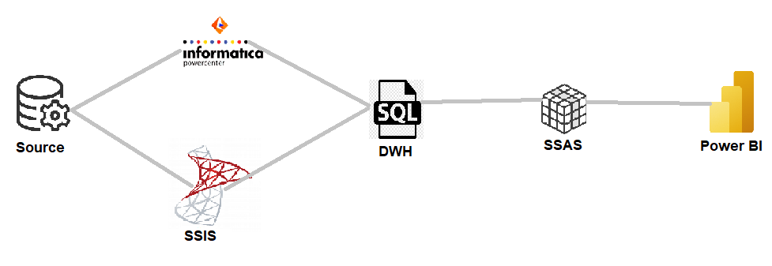
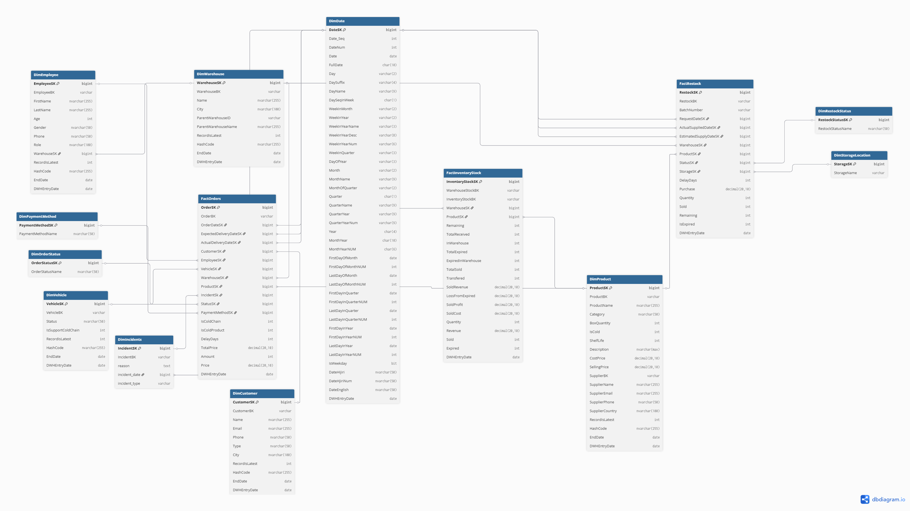
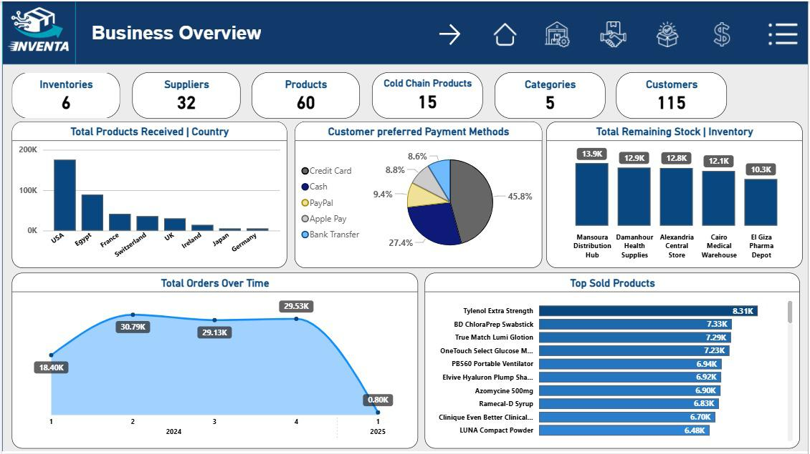
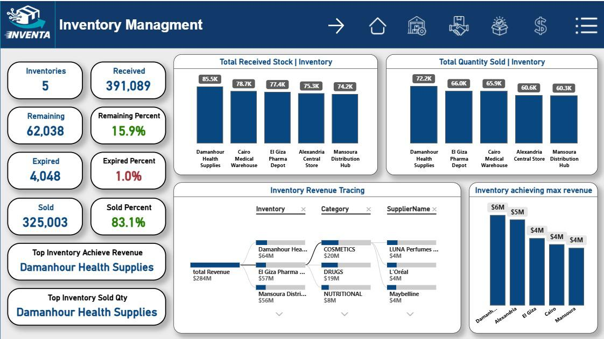
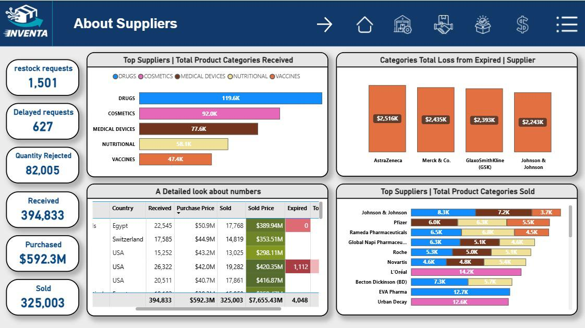
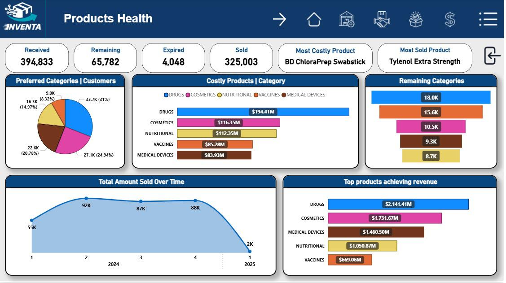
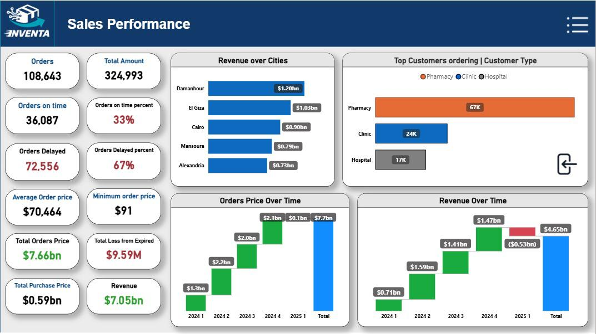

# Inventa IDC Solutions – Internship Project

## 📌 Overview
This project was developed during my internship at **Inventa IDC Solutions**.  
It is an end-to-end **Data Engineering & BI solution** that covers the full data lifecycle:
- **Data ingestion & integration**
- **Data warehouse design (Galaxy Schema)**
- **ETL pipelines using Informatica PowerCenter & SSIS**
- **Data visualization & insights with Power BI & SSAS**

The solution demonstrates how raw data is transformed into a structured warehouse, and finally into **business insights dashboards** that support decision-making.

---

## 🏗️ Architecture
The architecture follows a **Business → Landing → Staging → Warehouse → Reporting** approach:



**Steps:**
0. **Business & KPIs Definition** – Identify the required KPIs and metrics with business stakeholders  
1. **Landing Layer** – Raw data ingested from SQL Server  
2. **Staging Layer** – Incremental loads with SCD2 logic to preserve history  
3. **Warehouse Layer** – Galaxy schema (Fact & Dimension tables with shared dimensions)  
4. **Reporting Layer** – Business insights & dashboards using Power BI and SSAS  

---

## ⚙️ Tech Stack
- **ETL Tools**: Informatica PowerCenter, SSIS  
- **Database**: SQL Server  
- **BI Tools**: Power BI, SSAS  
- **Data Modeling**: Galaxy Schema (Facts & shared Dimensions)  

---

## 🔄 Data Pipeline


- **Source Systems** → Landing tables (truncate & load from SQL Server)  
- **Staging Layer** → Apply incremental loads, surrogate keys, SCD2  
- **Warehouse Layer** → Galaxy schema optimized for analytics  
- **Reporting Layer** → Power BI dashboards & SSAS cubes for advanced analytics  

---

## 🗄️ Data Model
The **Galaxy Schema** was designed to optimize querying and reporting, with multiple fact tables connected to shared dimensions.



- **Fact Tables**: Contain business metrics (e.g., Warehouse availability, Sales facts, Supplier performance)  
- **Dimension Tables**: Contain descriptive attributes (e.g., Products, Suppliers, Time, Store)  
- **Shared Dimensions**: Ensure consistency across facts in the Galaxy Schema  

---

## 📊 Insights & Dashboards
Power BI & SSAS were used to deliver **business insights and multidimensional analysis**.  

This solution delivers **5 main dashboards**:

1. **Business Overview Dashboard**  
   

2. **Inventory KPIs Dashboard**   
   

3. **Suppliers Dashboard** 
   

4. **Product KPIs Dashboard**   
   

5. **Sales Overview Dashboard** 
   

---

### 📌 Key KPIs Covered
- **Inventory Turnover** – How efficiently inventory is being managed and sold  
- **Stock Aging** – Identifies how long products remain in stock  
- **Supplier On-Time Delivery** – Measures supplier reliability and delivery performance  
- **Product Availability** – Tracks percentage of products available when needed  
- **Sales Growth** – Monitors sales performance trends over time  

---

## 🚀 How to Run
1. Clone the repository:
   ```bash
   git clone https://github.com/HaiidyHossam/Inventa-IDC-Solutions-Internship-Project.git
   cd Inventa-IDC-Solutions-Internship-Project

